# Google Cloud Platform (GCP) VM Instance Setup
## ECBM E4040 2026 Fall

This readme contains extensive instructions on how to setup a VM instance with CUDA/TensorFlow to run assignments/presentation code demos/final project code for this course. VM instances provide a highly customizable platform for you
to execute model development and training code.

## **[IMPORTANT NEW FOR 2026]**
**[PLEASE READ CAREFULLY BEFORE YOU START]**: Columbia has disabled the use of External IPs in GCP within the Columbia Organization. Therefore, if you are using GCP with your Columbia account (LionMail login), you can no longer connect to your Jupyter Notebook / Lab by pasting your external ID together with your chosen port into the browswer. Instead, we provide you with two options to use GCP:
  1. Use Your Personal Email and follow the instructions below. This is much simpler and enables you to use the External ID as usual.
  2. If you accidentally claim the coupon using your LionMail account, use Google Cloud SDK (gcloud) with port forwarding.

### [Important] Read the following notes below before setup:
#### [Note 1]
Start this process early! GCP resources are based on availability and are not guaranteed to be allocated to a user. You might have to keep retrying to get a machine with the desired GPU.
#### [Note 2]
**Make sure that you are claiming the coupon using your PERSONAL Email account (Top Right side of the screen with your initial) (more information on how to redeem the coupon is found in step 3 below). Columbia has recently changed their GCP policies, and has restricted the use of External IPs and internet if using their organization. We have provided backup instructions if you accidentally use your Columbia Email.**
#### [Note 3]
**Again, always double check that you are using the correct account when working with GCP (Top Right side of the screen with your initial).**
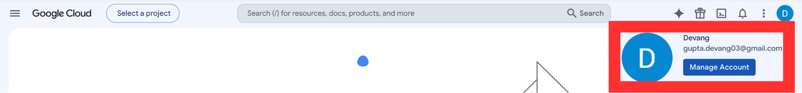

#### [Note 4]
**VERY IMPORTANT** - Switch off any machines that are not in use! **You will be charged every hour that the instance is active.** The rate depends on the machine configuration chosen. **You will also be charged
for any disks that are created at the end of the month** (usually the charge for disks is much less than running an instance, but if you run out of credits and have active disks, you will still get charged to your card).

Any issues with billing/accidental charges need to be handled with Google Cloud support directly.

#### [Note 5]

**You will receive only one GCP coupon for the entire semester, which must be used for all assignments and the course project. Please use your GCP credits carefully by selecting cost-effective VM configurations and stopping or shutting down VM instances whenever they are not in use to avoid unnecessary charges.** 


## Steps
<h3 style="color: red;"><strong>Open the link below in incognito tab.</strong></h3>
1. Go to the Google cloud console (https://cloud.google.com/) and sign in with your Personal Google account (**DO NOT USE** yourUNI@columbia.edu).
**Your google coupon is associated with a single account, so make sure that you always sign into the same account.**

2. If you are a new user of Google cloud, you can get $300 credits for free by clicking 'Get started for free'. If you already have used GCP, you can skip this step.
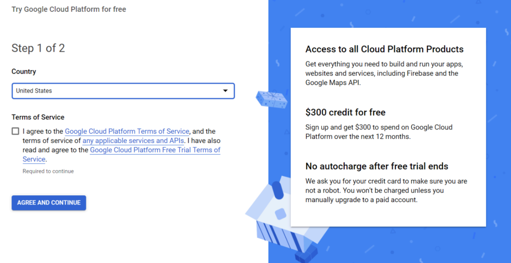
You can explore the GCP for a while with free credits. After the add/drop period, students will get educational coupons from instructors to cover course-related google cloud expenses.

3. Redeem your educational Google Cloud coupons (Google Cloud coupons will be distributed through Email after the add/drop period). Charges for using a GPU can be approximately $1/hour - so please manage your computational resources wisely.
You can claim your GCP coupons using the following link: following link: https://console.cloud.google.com/education. Fill in your name and your Personal Account (**DO NOT USE** yourUNI@columbia.edu).
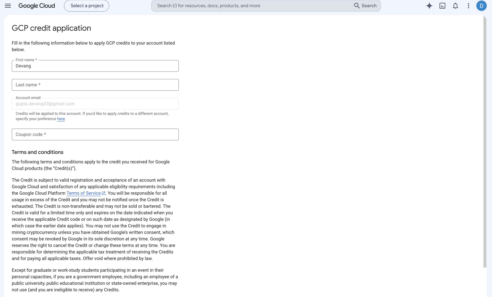

4. Go to the dropdown at the top to create a new project:
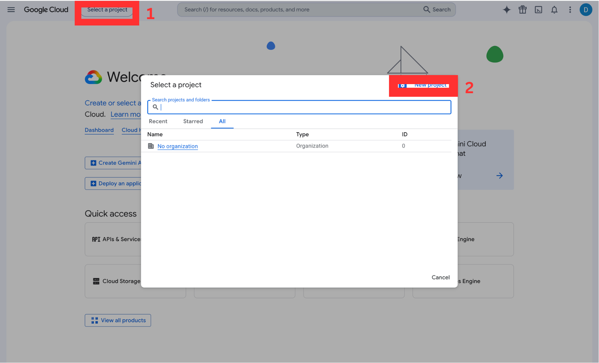

5. Fill in the details to create your project. **Set the billing account to 'Billing account for Education' to use your credits for this project. *Then Select "No organization".***
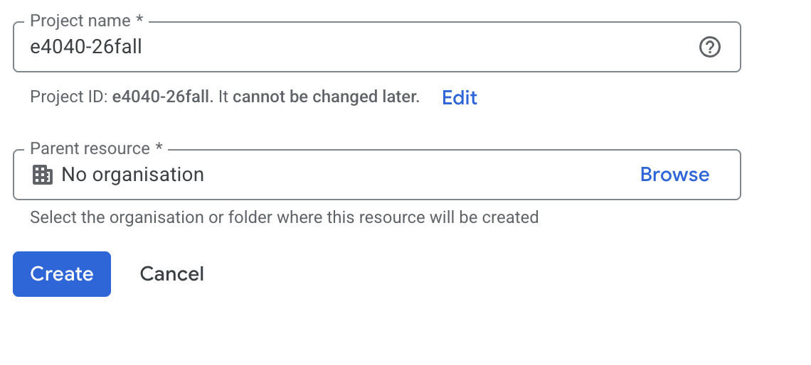
***Please make sure that the billing account and organization info are properly selected.***

6. Go to "Compute Engine" -> "VM instances" and enable the API.
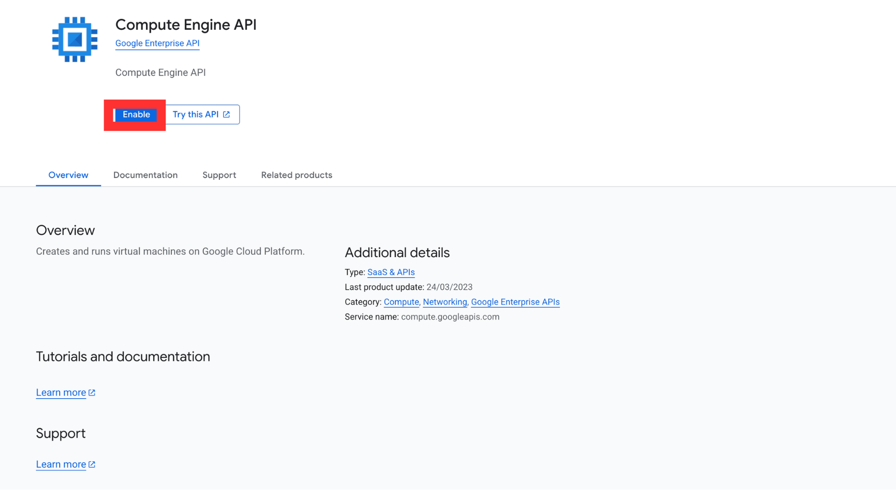

7. **Manage Quotas**:
   - Go to the "IAM & Admin" -> "Quotas & System Limits"

   - Filter for "gpus_all_regions". Check if the quota is at least 1
   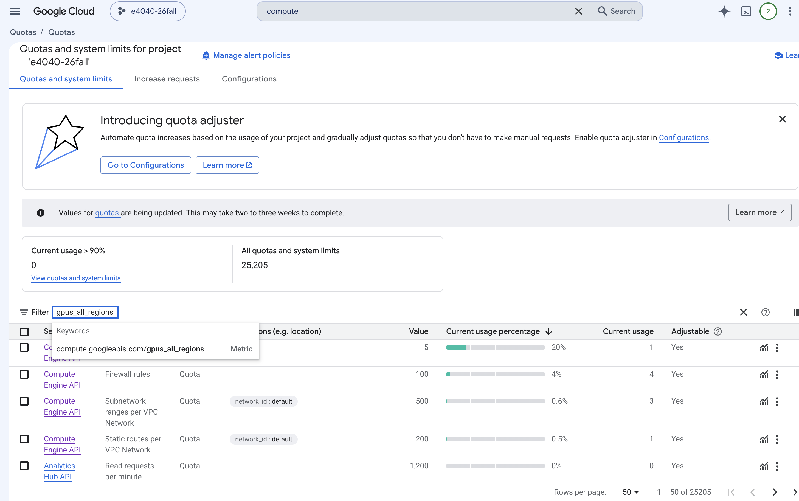

   - If the quota value is 0, edit the quota by clicking the dots on the side.
   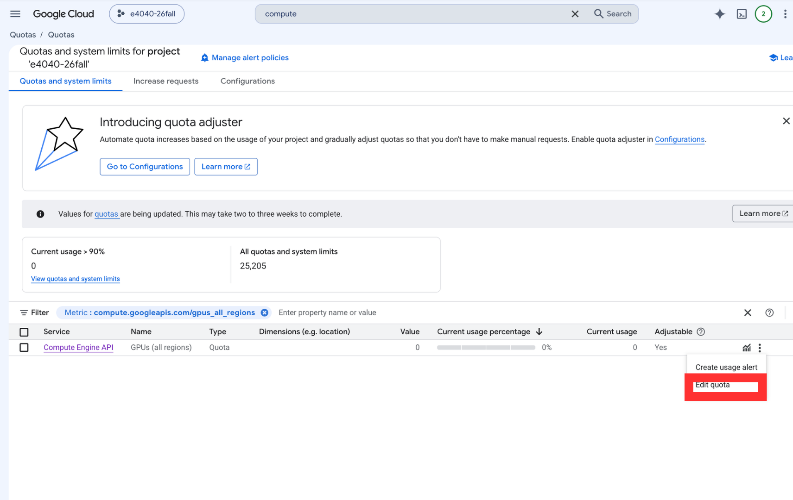

   - Set the limit to 1 (You can request an increase later if you need more GPUs, but we recommend starting with 1).
   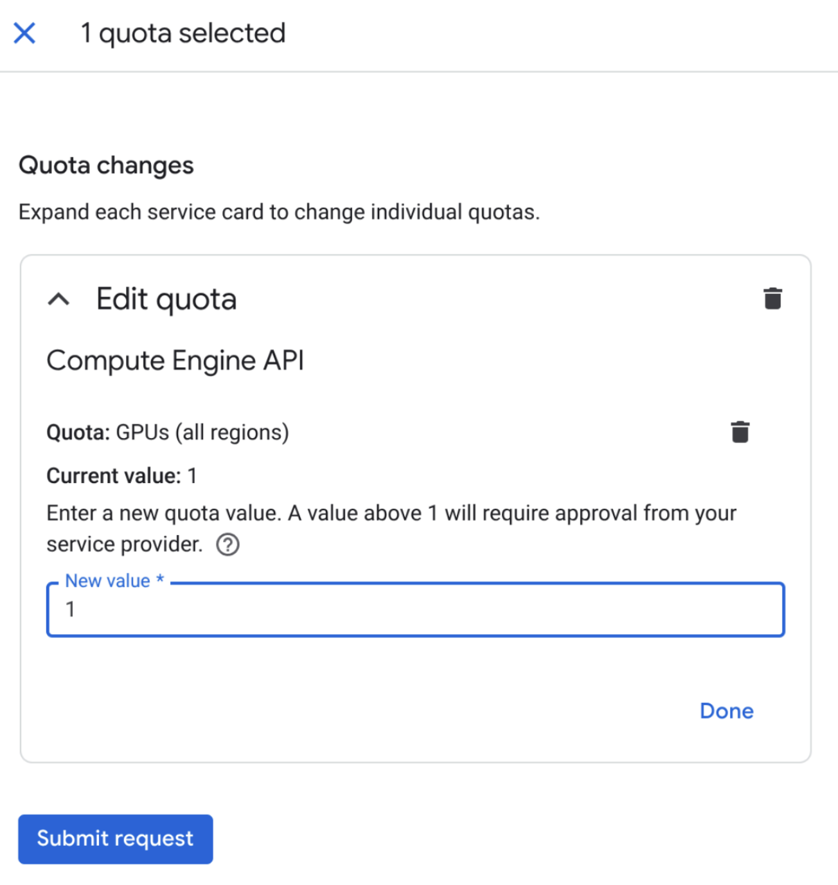

   - Wait for a moment to let Google process your request.
    You should receive an e-mail from Google informing you that they received the request. You will receive another e-mail after your quota request is approved.
    Note that the quota editing request waiting period might vary from minutes to a few hours to 4 days or even longer, depending on the general quota demand. Typically, it takes longer for Google to process the requests at the end of the semester. Please be aware of that fact and manage your time for project experiments at the end of semester properly.

8. Create a GCP VM Instance
  - Go to "Compute Engine" -> "VM instances" and click "Create Instance" at the top.
  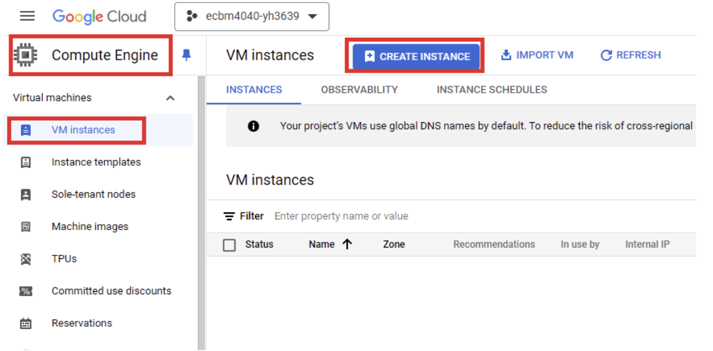
  - You will need to select a machine configuration. The recommended configuration is provided below and seen in the screenshot below. The prices may be different at different regions.
    - In "Machine configuration", select
      - GPU type: NVIDIA T4 (or L4)
      - Number of GPUs: 1
      - Machine type: n1-standard-4

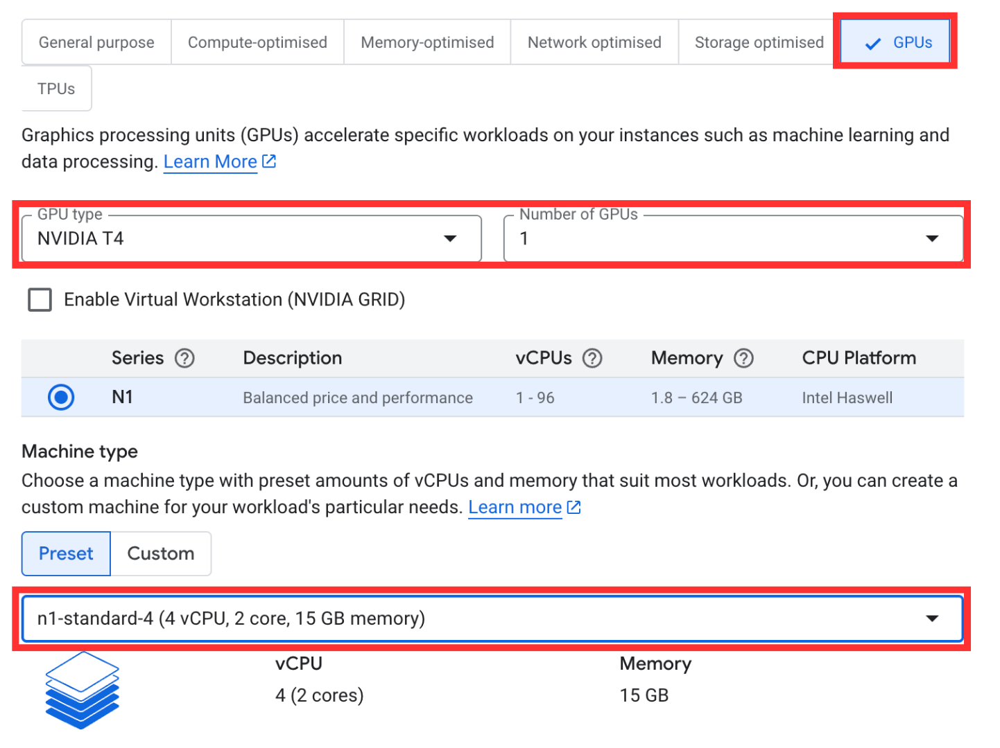
    
  - Note that a T4 gpu is not a particularly powerful GPU, so dealing with large models/datasets might require better GPUs. **Better GPUs are typically much harder to get and far more expensive**, so plan accordingly.

  - Scroll down to the bottom to select a provision model. It is recommended to use **"Standard"**, which gives you exclusive access to your VM.

  - On the right, go to the "OS and storage" section, click "Change", and set the boot image as shown below:
  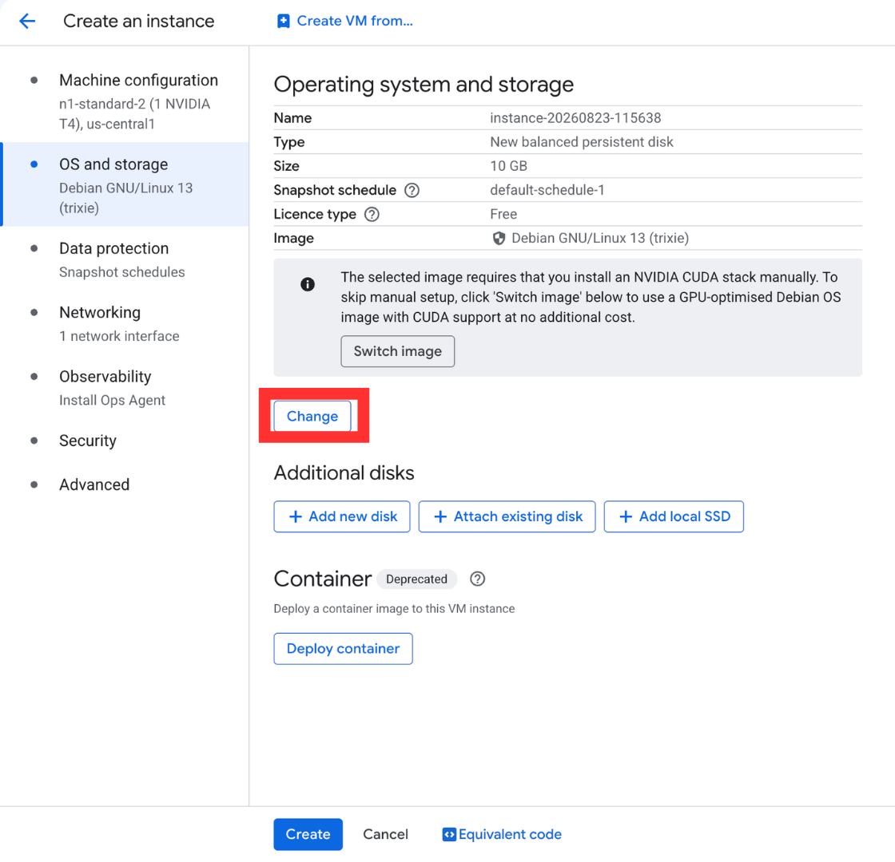
  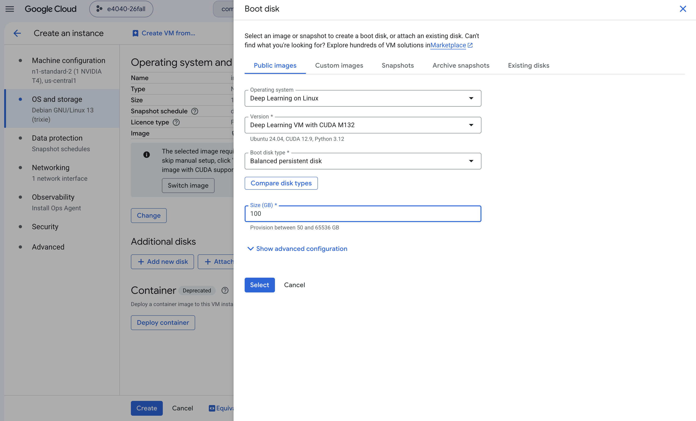

    Basic tools like CUDA/Python will be readily available for you.

  - You can further increase the disk space as necessary, but keep in mind that it will increase the cost of your machine. It is also possible to adjust the disk space at any point later by editing the machine.

  - On the right, go to the "Networking" section. Allow both HTTP and HTTPS traffic.
   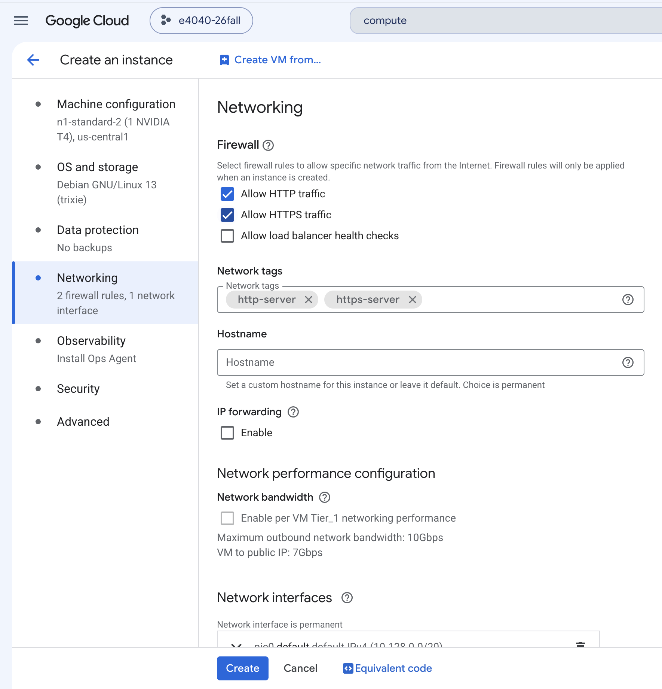

  - Click Create.

9.  Your machine should be available and running after a couple minutes. **Note that it is possible to get the "resource unavailable" error, which means that you will have to try after some time or in a different region.**
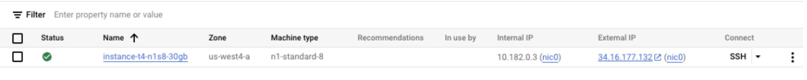

<!--
  - If you constantly runs into "resource unavailable" error, another option is to change the "Provisioning model" selection to "Spot" as shown below, as a **temporary alternative**.
  
  **Note that this gives you only temporary access to the compute resource, which may be preemted at any time. It is thus important to sync your work to Github in a very timely manner. It is recommended to use the standard provisioning model whenever possible.**
  -->

10.  [**For Columbia LionMail Users** (*This is only applicable if you have mistakenly created the project using your Columbia account.*)]:  Columbia has restricted the exposure of external IP address and internet access from GCP within their organization. To setup internet access, please watch and follow the instructions in [this video](https://drive.google.com/file/d/1d07DYyiW0sSwjYeSyzm3vlB--RV7vm9w/view?usp=sharing3).

11.  Google Cloud SDK - follow the instructions at [https://cloud.google.com/sdk/docs/install] to install the gcloud command line tools. This means you can SSH (connect) from your local system to the GCP instance. For Windows users, you can use [https://putty.org/](PuTTY); MacOS users can use the default Terminal application.
  - An alternative is to use the in-browser ssh by clicking the "SSH" button next to the machine. However, this is not recommended as the connection through the in-browser ssh may not be stable and can frequently drop.
  - After installing the gcloud command line tools, you will be prompted through the setup process where you can select your project/region/zone. Run `which gcloud` in your console to verify it is installed correctly
  <!---->
  - Go back to your GCP VM Instance dashboard. Next to the "SSH" button, you should see a small arrow. Click it and select "View gcloud command".

    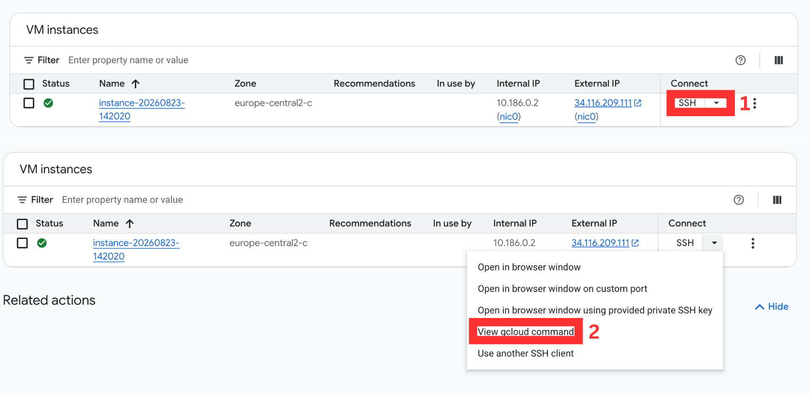
  
    ```
    gcloud compute ssh <YOUR_INSTANCE_NAME> --project=<YOUR_PROJECT_NAME> --zone=<YOUR_ZONE> --tunnel-through-iap
    ```

<!--12.   Paste this command in your console to connect to your instance. As soon as you connect, you will be prompted to install the NVIDIA drivers. Enter "y" to install the drivers:

Note: You can reinstall the drivers at any point later when you boot up the machine if there was some issue. As soon as you connect to the machine, you will get instructions on how to do so:
-->

12. Your instance is ready! We start by installing [Miniconda](https://www.anaconda.com/docs/getting-started/miniconda/install#linux-terminal-installer), an environment manager for terminals.
  - Download Miniconda
    ```
    wget https://repo.anaconda.com/miniconda/Miniconda3-latest-Linux-x86_64.sh
    ```
  - Run the installation script and follow the instructions:
    ```
    bash ~/Miniconda3-latest-Linux-x86_64.sh
    ```
    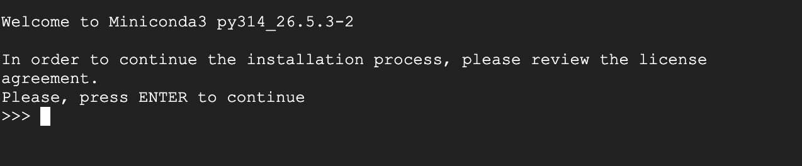
    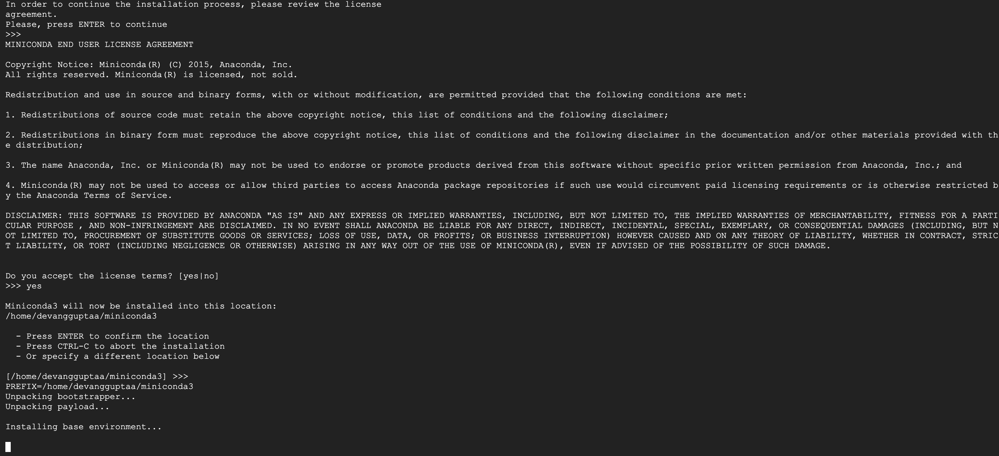
  - Remember to allow initialization during the installation process. Otherwise, initialize conda manually by the following command
    ```
    ./miniconda3/condabin/conda init
    ```
  - If the installation is successful, refresh the terminal for the installation to take effect by running the following:
    ```
    source ~/.bashrc
    ```
    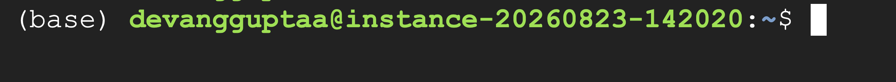
  - You should be able to see that the **"base"** environment is already activated.

13. Creating a virtual environemnt 
- Create a virtual environemnt within Miniconda with Python 3.13

  ```bash 
  conda create -n e4040 python=3.13 
  ```

- Activate the virtual environment 
  ``` bash 
  conda activate e4040
  ```
- Connect venv to Jupyter Notebook 
  ```bash
  conda install ipykernel

  python -m ipykernel install --user --name=e4040 --display-name "Python (Miniconda Env)"
  ```
- Remember to actiavte your virtual environemnt before executing any code. This virtual environement will manage all libraries and packages required for the course. 

14. Install Jupyter
  - Run `pip install jupyter` to install the latest version of Jupyter Notebook/Lab.
  - Run the following command to start your jupyter server:
    ```
    jupyter lab --allow-root --no-browser --ip 0.0.0.0 --port 9999
    ```
    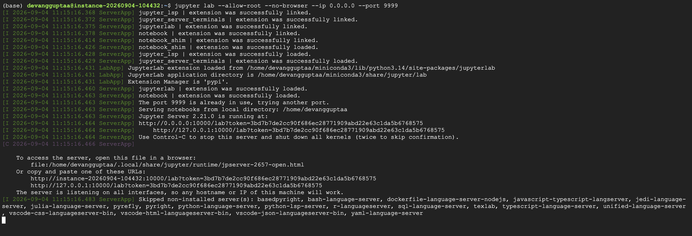
  - Copy the generated authentication token and the end of the URL (after `token=`), which will be used to connect to the laptop later.

    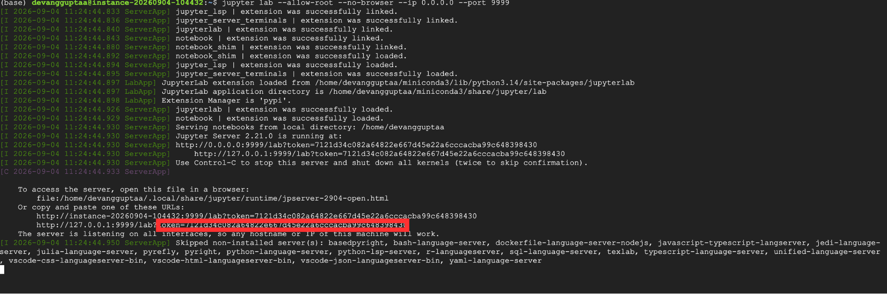

15. Open Jupyter Noteboook by configuring a firewall from the GCP dashboard
  - In GCP, go to "VPC network" -> "Firewall"
  - Create a firewall rule with any name you like, with the configuration below:
  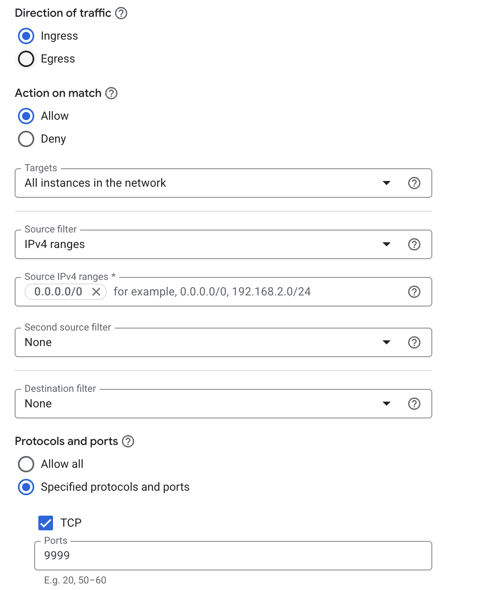
  - **This is the step where the Columbia Policy changes come into play**
  - If you used your Personal Email, you can do the following:
    - Navigate back to your VM instances page on the GCP. Your instance will have an External IP address - copy that IP address (yourExternalIP)
    - Go to a new tab in a browser on your laptop. Type http://yourExternalIP:9999. You should be directed to your Jupyter Notebook. Enter your authentication token.
    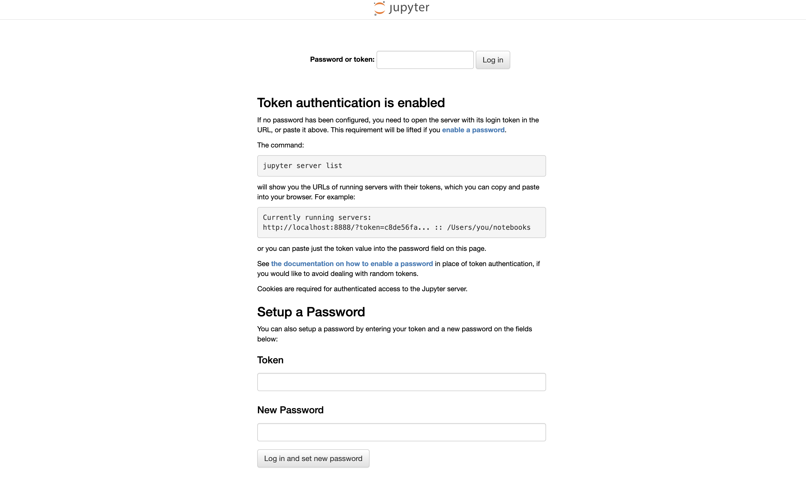
    - That's it! You can now use jupyter notebooks on your machine.
  - If you used your Columbia LionMail account, do the following:
    - Make sure that you enabled internet access for your instance by watching the video: https://drive.google.com/file/d/1d07DYyiW0sSwjYeSyzm3vlB--RV7vm9w/view?usp=sharing3
    - (Repeat of previous step) Launch your GCP instance using gcloud with port forwarding
      ```
      gcloud compute ssh <YOUR_INSTANCE_NAME> --project=<YOUR_PROJECT_NAME>  --zone=<YOUR_ZONE> --tunnel-through-iap -- -L 9999:localhost:9999
      ```
    - From your own computer, choose your favorite browser and you can access jupyter by pasting:
      ```
      localhost:9999     # Or whichever port you chose in your jupyter config file.
      ```
      <!---->
  - You can drag and drop notebooks from your local machine to this screen.

16. [**Important**] Switch off the machine when not in use. This will prevent your credits from being consumed.
<!---->

#### For any other questions or issues, please contact the E4040 teaching staff.
